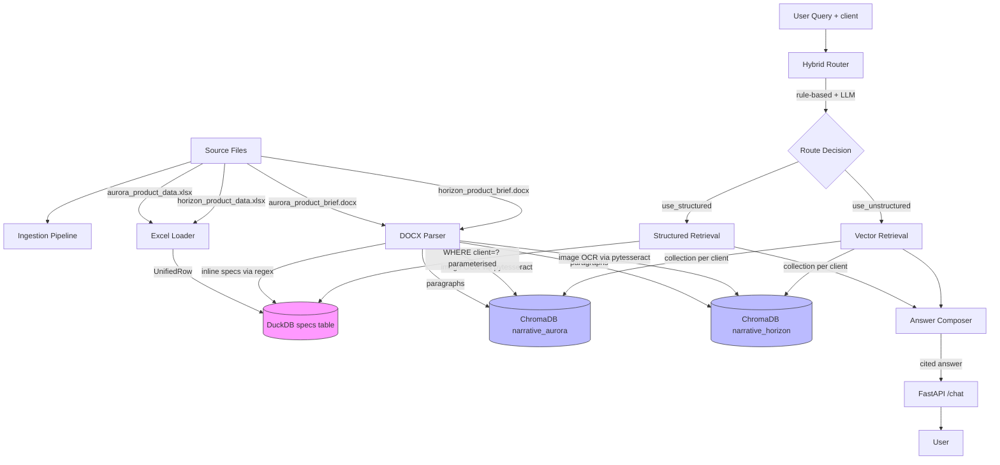

# Architecture

## System Diagram



## Key Design Decisions

### Unified Schema (DuckDB)
All structured specs normalised to a single table with per-client column maps in `ingest/schemas.py`:
- Aurora: `client_name → client`, `product_name → product`, `region → region`, etc.
- Horizon: `supplier_name → client`, `product_line → product`, `market → region`, etc.

### Per-Client Vector Collections
`narrative_aurora` and `narrative_horizon` — physical isolation prevents any API path from returning cross-client narrative chunks.

### Q4 Architecture (Comparison Queries)
Two independent retrieval calls (one per client) merged at compose time with explicit client labels. Never a single retrieval over a union.

### SQL Injection Prevention
All DuckDB queries use `?` parameterised binding. No f-strings with user-controlled values. Tested with payloads like `Aurora Paints'; --`.

## File Map

```
app/
├── ingest/
│   ├── schemas.py       Per-client column maps + UnifiedRow dataclass
│   ├── excel.py         openpyxl → list[UnifiedRow]
│   ├── docx_parse.py    python-docx → paragraphs + image OCR
│   ├── inline_specs.py  regex extractor for spec-shaped sentences
│   ├── image_ocr.py     pytesseract pipeline (bonus)
│   └── pipeline.py      ingest_all() orchestrator
├── stores/
│   ├── structured.py    DuckDB wrapper (parameterised queries)
│   └── vector.py        ChromaDB wrapper (per-client collections)
├── retrieval/
│   ├── router.py        Hybrid rule-based router
│   ├── structured.py    Parameterised spec search
│   ├── unstructured.py  Vector search per client
│   └── compose.py       Answer composition with citations
├── llm/
│   ├── client.py        OpenRouter via OpenAI SDK (retry on 429)
│   └── prompts.py       System prompts for router + composer
├── api/
│   ├── main.py          FastAPI app (/health, /sessions, /chat, /chat/stream)
│   ├── sse.py           SSE streaming helpers
│   └── sessions.py      In-memory session store (8-turn rolling memory)
└── cli/
    ├── ingest.py        python -m app.cli.ingest --sources <path>
    └── chat.py          Interactive REPL + demo runner
```
